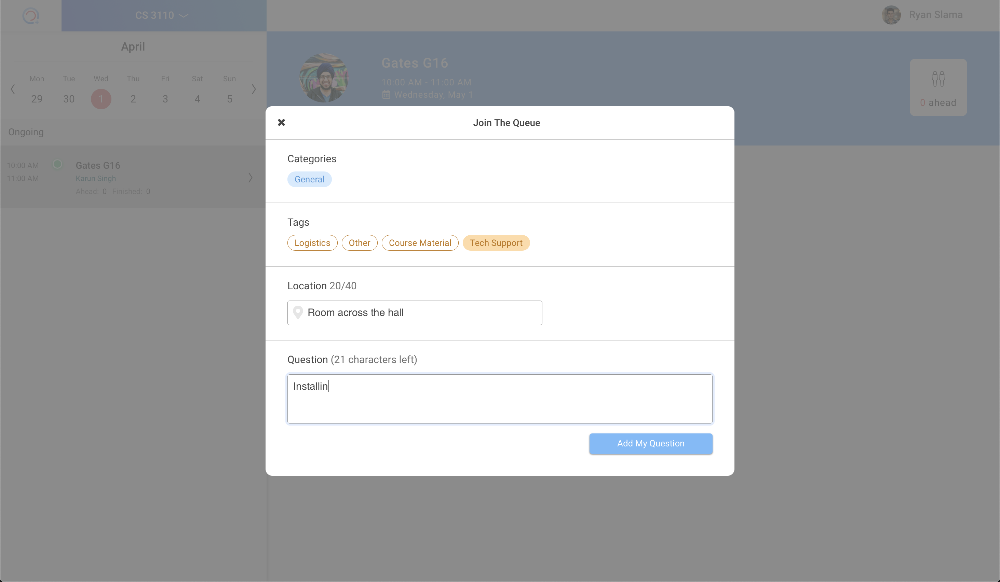

# Queue Me In
by [Cornell Digital Technology & Innovation](http://cornelldti.org)

#### Contents
  - [About](#about)
  - [Getting Started](#getting-started)
  - [Screenshots](#screenshots)
  - [Contributors](#contributors)

## About
Office hours are too crowded and unorganized. Queue Me In removes the frustration from office hours by helping students get support and professors better understand their class.

We make it easier for students to get help because they don't have to wait in crowded room or hallway, while simultaneously giving professors insight into office hours. Our visiualizations show when office hours are most in demand to help with scheduling hours as well as which parts of assignments generate the most questions to show where clarification might be beneficial.

## Getting Started
View the [setup documentation](./docs/setup.md) for instructions on setting up and getting started with development!

_Last updated **04/01/2019**_.

## Screenshots

_Screenshots showing major parts of app_

 

 

## Contributors

### 2023-24
* **Benjamin Tang** - Product Manager
* **Lily Pham** - Technical Project Manager
* **Richard Gu** - Software Developer
* **Sydney Tran** - Software Developer
* **Jessica Wang** - Software Developer
* **Sophie Wang** - Software Developer
* **Erin Xu** - Software Developer
* **Brandon Lee** - Designer
* **Jenny Zhang** - Designer
* **Raissa Ji** - Product Marketing Manager

### 2022-23
* **Pranavi Gupta** - Product Manager
* **Alex Nagel** - Technical Project Manager
* **Dana Kim** - Software Developer
* **Sung Woo Min** - Software Developer
* **Erin Xu** - Software Developer
* **Lily Pham** - Software Developer
* **Sydney Tran** - Software Developer

### 2021-22
* **Nada Attia** - Software Developer
* **Pooja Kanumalla** - Software Developer
* **Alex Nagel** - Software Developer
* **Dana Kim** - Software Developer
* **Sung Woo Min** - Software Developer
* **Erin Xu** - Software Developer
* **Archit Mehta** - Software Developer
* **Lily Pham** - Software Developer
* **Jeremy Jung** - Technical Project Manager
* **Sarah Kim** - Product Manager
* **Hank Lin** - Product Manager / Designer
* **Chenchen Lu** - Product Manager / Designer

### 2020-21
* **Nada Attia** - Software Developer
* **Vanessa Wang** - Software Developer
* **Connie Lei** - Software Developer
* **Guanqun Wu** - Software Developer
* **Jeremy Jung** - Software Developer
* **Alex Nagel** - Software Developer
* **Rose Zhou** - Software Developer
* **Ashley Ticzon** - Designer
* **Jalil Evans** - Designer
* **Sophia Wang** - Product Manager
* **Scott Wang** - Technical Project Manager
* **Vladia Trinh** - Front-end Software Developer
* **Pooja Kanumalla** - Software Developer

### 2019-20
* **Vanessa Wang** - Software Developer
* **Connie Lei** - Software Developer
* **Ryan Slama** - Software Developer
* **Robinson Burrell III** - Software Developer
* **Jordan Epstein** - Software Developer
* **Ashley Ticzon** - Designer
* **Jalil Evans** - Designer
* **Sophia Wang** - Product Manager
* **Bobby Villaluz** - Technical Project Manager
`
### 2018-19
* **Vanessa Wang** - Software Developer
* **Shefali Agarwal** - Software Developer
* **Rachel Nash** - Software Developer
* **Bobby Villaluz** - Software Developer
* **Robinson Burrell III** - Software Developer
* **Joyelle Gilbert** - Designer
* **Sophia Wang** - Designer
* **Yeon Kim** - Designer
* **Tiffany Wang** - Product Manager
* **Ryan Slama** - Product Manager

### 2017-18
* **Vanessa Wang** - Software Developer
* **Shefali Agarwal** - Software Developer
* **Horace He** - Software Developer
* **Ryan Slama** - Software Developer
* **Joyelle Gilbert** - Designer
* **Sophia Wang** - Designer
* **Sangwoo Kim** - Designer
* **Tiffany Wang** - Product Manager
* **Karun Singh** - Product Manager

We are a team within **Cornell Design & Tech Initiative**. For more information, see our [website](https://cornelldti.org/).

​
